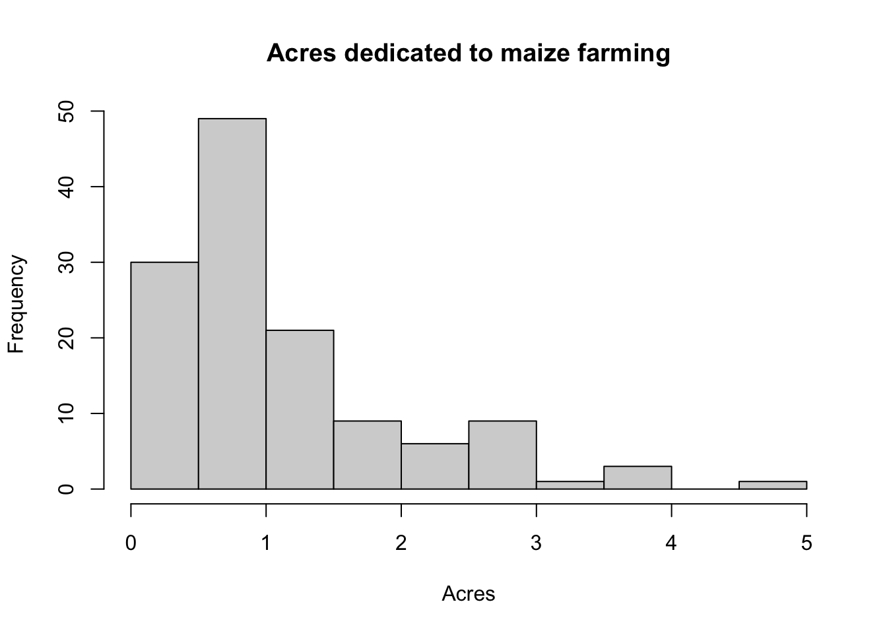
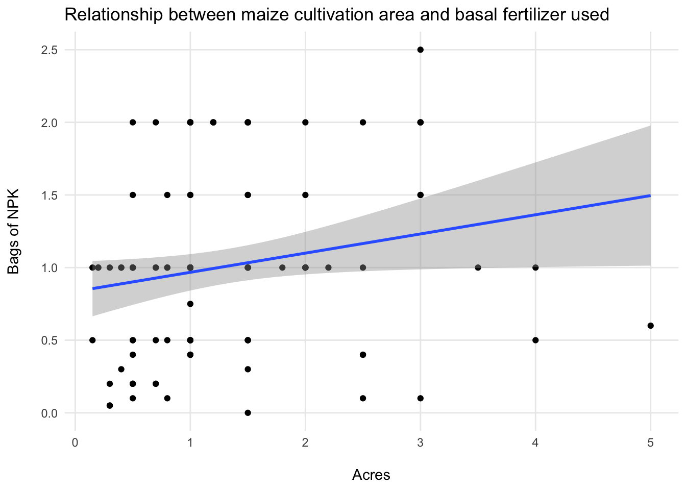
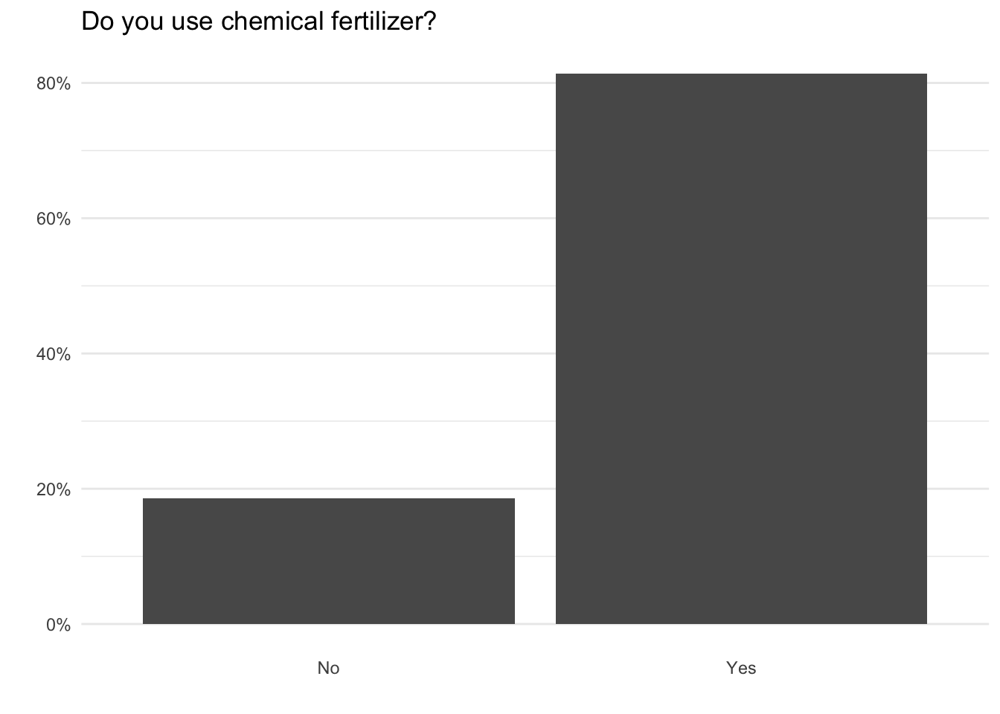
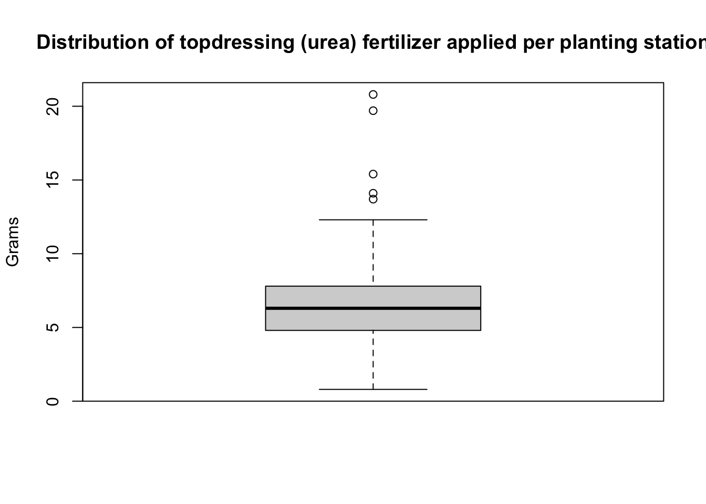

# mwfertiliserpilot: Data from maize fertiliser survey in Ntonda EPA, Southern Malawi

<!-- badges: start -->

[](https://creativecommons.org/licenses/by/4.0/) [](https://doi.org/10.5281/zenodo.14967536)

<!-- badges: end -->

## People involved

- Colin Walder <a href="https://orcid.org/0009-0006-0969-1954">
  
  0009-0006-0969-1954 </a> *author, creator*
- Cyrus Llyod *contributor*
- Davis Banda *contributor*
- Hildah Bonongwe *contributor*
- Kondwani Nantchito <a href="https://orcid.org/0009-0008-5773-129Х">
  
  0009-0008-5773-129Х </a> *contributor*
- Mayamiko Mbedza <a href="https://orcid.org/0009-0005-3787-7492">
  
  0009-0005-3787-7492 </a> *contributor*
- Phalyce George *contributor*
- Elizabeth Tilley <a href="https://orcid.org/0000-0002-2095-9724">
  
  0000-0002-2095-9724 </a> *contributor*

Maize plays a central role in Malawi, yet best practices regarding its
cultivation are rarely followed. Often, too much or too little
fertilizer is used per planting station, spacing between and across
planting stations varies widely and the appropriate seeds are rarely
used.

This dataset contains fertilizer management data from 129 farmers in the
Ntonda Extension Planning Area (EPA) in Blantyre District in southern
Malawi. Over a period of one week, farmers in different sections of the
EPA were interviewed about their practices regarding maize cultivation.
In addition, samples of both basal (NPK) and topdressing (urea)
fertilizer were taken (`basal_fertilizer_grams` and
`topdressing_fertilizer_grams`) to better understand how much fertilizer
is used per planting station.

## Installation

You can install the development version of mwfertiliserpilot from
[GitHub](https://github.com/) with:

``` r
# install.packages("devtools")
devtools::install_github("openwashdata/mwfertiliserpilot")
```

Alternatively, you can download the individual datasets as a CSV or XLSX
file from the table below.

| dataset | CSV | XLSX |
|:---|:---|:---|
| mwfertiliserpilot | [Download CSV](https://github.com/openwashdata/mwfertiliserpilot/raw/main/inst/extdata/mwfertiliserpilot.csv) | [Download XLSX](https://github.com/openwashdata/mwfertiliserpilot/raw/main/inst/extdata/mwfertiliserpilot.xlsx) |

## Data

``` r
library(mwfertiliserpilot)
```

### mwfertiliserpilot

The dataset `mwfertiliserpilot` contains data from 129 farmers regarding
their maize fertilizer management in Ntonda EPA, Blantyre District,
Malawi.

For an overview of the variable names, see the following table.

<div style="border: 1px solid #ddd; padding: 0px; overflow-y: scroll; height:200px; ">

<table class="table table-striped" style="color: black; margin-left: auto; margin-right: auto;">

<thead>

<tr>

<th style="text-align:left;position: sticky; top:0; background-color: #FFFFFF;">

variable_name
</th>

<th style="text-align:left;position: sticky; top:0; background-color: #FFFFFF;">

variable_type
</th>

<th style="text-align:left;position: sticky; top:0; background-color: #FFFFFF;">

description
</th>

</tr>

</thead>

<tbody>

<tr>

<td style="text-align:left;">

start
</td>

<td style="text-align:left;">

double
</td>

<td style="text-align:left;">

Survey start
</td>

</tr>

<tr>

<td style="text-align:left;">

end
</td>

<td style="text-align:left;">

double
</td>

<td style="text-align:left;">

Survey end
</td>

</tr>

<tr>

<td style="text-align:left;">

today
</td>

<td style="text-align:left;">

double
</td>

<td style="text-align:left;">

Survey date
</td>

</tr>

<tr>

<td style="text-align:left;">

consent
</td>

<td style="text-align:left;">

character
</td>

<td style="text-align:left;">

Do you give consent to proceed with this survey?
</td>

</tr>

<tr>

<td style="text-align:left;">

village_name
</td>

<td style="text-align:left;">

character
</td>

<td style="text-align:left;">

Please enter the name of the village.
</td>

</tr>

<tr>

<td style="text-align:left;">

gvh_name
</td>

<td style="text-align:left;">

character
</td>

<td style="text-align:left;">

Please enter the name of the group village head (GVH).
</td>

</tr>

<tr>

<td style="text-align:left;">

ta_name
</td>

<td style="text-align:left;">

character
</td>

<td style="text-align:left;">

Please enter the name of the traditional authority (TA).
</td>

</tr>

<tr>

<td style="text-align:left;">

farmer_gender
</td>

<td style="text-align:left;">

character
</td>

<td style="text-align:left;">

Please enter the farmer’s gender.
</td>

</tr>

<tr>

<td style="text-align:left;">

farmer_age
</td>

<td style="text-align:left;">

double
</td>

<td style="text-align:left;">

Please enter the farmer’s age.
</td>

</tr>

<tr>

<td style="text-align:left;">

farmer_hoh
</td>

<td style="text-align:left;">

character
</td>

<td style="text-align:left;">

Are you the head of the household?
</td>

</tr>

<tr>

<td style="text-align:left;">

hoh_education
</td>

<td style="text-align:left;">

character
</td>

<td style="text-align:left;">

What is your highest level of education?
</td>

</tr>

<tr>

<td style="text-align:left;">

n_years_farming
</td>

<td style="text-align:left;">

character
</td>

<td style="text-align:left;">

How many years have you been farming?
</td>

</tr>

<tr>

<td style="text-align:left;">

own_livestock
</td>

<td style="text-align:left;">

character
</td>

<td style="text-align:left;">

Do you own any livestock (cows, chickens, pigs, etc.)?
</td>

</tr>

<tr>

<td style="text-align:left;">

own_livestock_animals
</td>

<td style="text-align:left;">

character
</td>

<td style="text-align:left;">

Do you own…?
</td>

</tr>

<tr>

<td style="text-align:left;">

own_livestock_animals.cows
</td>

<td style="text-align:left;">

integer
</td>

<td style="text-align:left;">

NA
</td>

</tr>

<tr>

<td style="text-align:left;">

own_livestock_animals.chickens
</td>

<td style="text-align:left;">

integer
</td>

<td style="text-align:left;">

NA
</td>

</tr>

<tr>

<td style="text-align:left;">

own_livestock_animals.pigs
</td>

<td style="text-align:left;">

integer
</td>

<td style="text-align:left;">

NA
</td>

</tr>

<tr>

<td style="text-align:left;">

own_livestock_animals.goats
</td>

<td style="text-align:left;">

integer
</td>

<td style="text-align:left;">

NA
</td>

</tr>

<tr>

<td style="text-align:left;">

own_livestock_animals.sheep
</td>

<td style="text-align:left;">

integer
</td>

<td style="text-align:left;">

NA
</td>

</tr>

<tr>

<td style="text-align:left;">

own_livestock_animals.other
</td>

<td style="text-align:left;">

integer
</td>

<td style="text-align:left;">

NA
</td>

</tr>

<tr>

<td style="text-align:left;">

farming_main_income
</td>

<td style="text-align:left;">

character
</td>

<td style="text-align:left;">

Is farming your household’s main source of income?
</td>

</tr>

<tr>

<td style="text-align:left;">

household_main_income
</td>

<td style="text-align:left;">

character
</td>

<td style="text-align:left;">

What is your household’s main source of income?
</td>

</tr>

<tr>

<td style="text-align:left;">

n_acres_farm
</td>

<td style="text-align:left;">

double
</td>

<td style="text-align:left;">

How large is your farm (in acres)?
</td>

</tr>

<tr>

<td style="text-align:left;">

n_acres_maize
</td>

<td style="text-align:left;">

double
</td>

<td style="text-align:left;">

How much area is dedicated to maize farming (in acres)?
</td>

</tr>

<tr>

<td style="text-align:left;">

source_water_farm
</td>

<td style="text-align:left;">

character
</td>

<td style="text-align:left;">

Is this area rain-fed or part of an irrigation scheme?
</td>

</tr>

<tr>

<td style="text-align:left;">

chem_fertilizer
</td>

<td style="text-align:left;">

character
</td>

<td style="text-align:left;">

Did you apply chemical fertilizer this year?
</td>

</tr>

<tr>

<td style="text-align:left;">

chem_fertilizer_type
</td>

<td style="text-align:left;">

character
</td>

<td style="text-align:left;">

What chemical fertilizer do you use?
</td>

</tr>

<tr>

<td style="text-align:left;">

n_bags_npk
</td>

<td style="text-align:left;">

double
</td>

<td style="text-align:left;">

How many bags of NPK did you apply THIS YEAR?
</td>

</tr>

<tr>

<td style="text-align:left;">

n_bags_npk_subsidized
</td>

<td style="text-align:left;">

double
</td>

<td style="text-align:left;">

How many of those were subsidised?
</td>

</tr>

<tr>

<td style="text-align:left;">

price_bags_npk_nonsubsidized
</td>

<td style="text-align:left;">

double
</td>

<td style="text-align:left;">

How much did you pay for a full-priced bag of NPK?
</td>

</tr>

<tr>

<td style="text-align:left;">

price_bags_npk_subsidized
</td>

<td style="text-align:left;">

double
</td>

<td style="text-align:left;">

How much did you pay for a subsidised bag of NPK?
</td>

</tr>

<tr>

<td style="text-align:left;">

enough_bags_npk
</td>

<td style="text-align:left;">

character
</td>

<td style="text-align:left;">

Was this enough NPK to meet your needs?
</td>

</tr>

<tr>

<td style="text-align:left;">

n_bags_npk_desired
</td>

<td style="text-align:left;">

double
</td>

<td style="text-align:left;">

How many bags of NPK would you have liked?
</td>

</tr>

<tr>

<td style="text-align:left;">

n_bags_npk_buying_next_year
</td>

<td style="text-align:left;">

double
</td>

<td style="text-align:left;">

How many bags of NPK will you try to buy for the coming year?
</td>

</tr>

<tr>

<td style="text-align:left;">

n_bags_urea
</td>

<td style="text-align:left;">

double
</td>

<td style="text-align:left;">

How many bags of urea did you apply THIS YEAR?
</td>

</tr>

<tr>

<td style="text-align:left;">

n_bags_urea_subsidized
</td>

<td style="text-align:left;">

double
</td>

<td style="text-align:left;">

How many of those were subsidised?
</td>

</tr>

<tr>

<td style="text-align:left;">

price_bags_urea_nonsubsidized
</td>

<td style="text-align:left;">

double
</td>

<td style="text-align:left;">

How much did you pay for a full-priced bag of urea?
</td>

</tr>

<tr>

<td style="text-align:left;">

price_bags_urea_subsidized
</td>

<td style="text-align:left;">

double
</td>

<td style="text-align:left;">

How much did you pay for a subsidised bag of urea?
</td>

</tr>

<tr>

<td style="text-align:left;">

enough_bags_urea
</td>

<td style="text-align:left;">

character
</td>

<td style="text-align:left;">

Was this enough urea to meet your needs?
</td>

</tr>

<tr>

<td style="text-align:left;">

n_bags_urea_desired
</td>

<td style="text-align:left;">

double
</td>

<td style="text-align:left;">

How many bags of urea would you have liked?
</td>

</tr>

<tr>

<td style="text-align:left;">

n_bags_urea_buying_next_year
</td>

<td style="text-align:left;">

double
</td>

<td style="text-align:left;">

How many bags of urea will you try to buy for the coming year?
</td>

</tr>

<tr>

<td style="text-align:left;">

able_buy_bags_past
</td>

<td style="text-align:left;">

character
</td>

<td style="text-align:left;">

Were you able to buy all the fertilizer you require 5 years ago?
</td>

</tr>

<tr>

<td style="text-align:left;">

n_bags_maize_t1_season
</td>

<td style="text-align:left;">

double
</td>

<td style="text-align:left;">

How many bags of maize did you harvest in the last growing season?
</td>

</tr>

<tr>

<td style="text-align:left;">

n_bags_maize_t2_season
</td>

<td style="text-align:left;">

double
</td>

<td style="text-align:left;">

How many bags of maize did you harvest two growing seasons ago?
</td>

</tr>

<tr>

<td style="text-align:left;">

n_bags_maize_t3_season
</td>

<td style="text-align:left;">

double
</td>

<td style="text-align:left;">

How many bags of maize did you harvest three growing seasons ago?
</td>

</tr>

<tr>

<td style="text-align:left;">

fertilizer_comparison_5years
</td>

<td style="text-align:left;">

character
</td>

<td style="text-align:left;">

Do you need more, less or the same amount of chemical fertilizer to grow
the same amount of maize now as you did 5 years ago?
</td>

</tr>

<tr>

<td style="text-align:left;">

same_tool_for_fertilizer
</td>

<td style="text-align:left;">

character
</td>

<td style="text-align:left;">

Do you use the same tool to apply NPK (basal) and urea (topdressing)?
</td>

</tr>

<tr>

<td style="text-align:left;">

single_tool_fertilizer
</td>

<td style="text-align:left;">

character
</td>

<td style="text-align:left;">

What tool do you use to apply them?
</td>

</tr>

<tr>

<td style="text-align:left;">

single_tool_fertilizer_other
</td>

<td style="text-align:left;">

character
</td>

<td style="text-align:left;">

Please specify.
</td>

</tr>

<tr>

<td style="text-align:left;">

tool_basal_fertilizer
</td>

<td style="text-align:left;">

character
</td>

<td style="text-align:left;">

What tool do you use to apply NPK (basal fertilizer) in your field?
</td>

</tr>

<tr>

<td style="text-align:left;">

tool_basal_fertilizer_other
</td>

<td style="text-align:left;">

character
</td>

<td style="text-align:left;">

Please specify.
</td>

</tr>

<tr>

<td style="text-align:left;">

tool_topdressing_fertilizer
</td>

<td style="text-align:left;">

character
</td>

<td style="text-align:left;">

What tool do you use to apply urea (topdressing fertilizer) in your
field?
</td>

</tr>

<tr>

<td style="text-align:left;">

tool_topdressing_fertilizer_other
</td>

<td style="text-align:left;">

character
</td>

<td style="text-align:left;">

Please specify.
</td>

</tr>

<tr>

<td style="text-align:left;">

timing_fertilizer
</td>

<td style="text-align:left;">

character
</td>

<td style="text-align:left;">

Do you apply NPK and urea at different times or the same time?
</td>

</tr>

<tr>

<td style="text-align:left;">

timing_fertilizer_mix_ntimes
</td>

<td style="text-align:left;">

character
</td>

<td style="text-align:left;">

Do you apply the mix once or twice?
</td>

</tr>

<tr>

<td style="text-align:left;">

timing_fertilizer_mix
</td>

<td style="text-align:left;">

character
</td>

<td style="text-align:left;">

When do you apply them?
</td>

</tr>

<tr>

<td style="text-align:left;">

timing_fertilizer_mix_other
</td>

<td style="text-align:left;">

character
</td>

<td style="text-align:left;">

Please specify.
</td>

</tr>

<tr>

<td style="text-align:left;">

place_fertilizer_mix
</td>

<td style="text-align:left;">

character
</td>

<td style="text-align:left;">

Where do you apply them?
</td>

</tr>

<tr>

<td style="text-align:left;">

place_fertilizer_mix_other
</td>

<td style="text-align:left;">

logical
</td>

<td style="text-align:left;">

Please specify.
</td>

</tr>

<tr>

<td style="text-align:left;">

ratio_fertilizer_mix_npk
</td>

<td style="text-align:left;">

double
</td>

<td style="text-align:left;">

What’s the NPK to urea ratio? Enter the number for NPK:
</td>

</tr>

<tr>

<td style="text-align:left;">

ratio_fertilizer_mix_urea
</td>

<td style="text-align:left;">

double
</td>

<td style="text-align:left;">

What’s the NPK to urea ratio? Enter the number for urea:
</td>

</tr>

<tr>

<td style="text-align:left;">

timing_fertilizer_mix_t1
</td>

<td style="text-align:left;">

character
</td>

<td style="text-align:left;">

When do you apply them for the first application?
</td>

</tr>

<tr>

<td style="text-align:left;">

timing_fertilizer_mix_t1_other
</td>

<td style="text-align:left;">

logical
</td>

<td style="text-align:left;">

Please specify.
</td>

</tr>

<tr>

<td style="text-align:left;">

place_fertilizer_mix_t1
</td>

<td style="text-align:left;">

character
</td>

<td style="text-align:left;">

Where do you apply them for the first application?
</td>

</tr>

<tr>

<td style="text-align:left;">

place_fertilizer_mix_t1_other
</td>

<td style="text-align:left;">

logical
</td>

<td style="text-align:left;">

Please specify.
</td>

</tr>

<tr>

<td style="text-align:left;">

ratio_fertilizer_mix_t1_npk
</td>

<td style="text-align:left;">

double
</td>

<td style="text-align:left;">

What’s the NPK to urea ratio for the first application? Enter the number
for NPK:
</td>

</tr>

<tr>

<td style="text-align:left;">

ratio_fertilizer_mix_t1_urea
</td>

<td style="text-align:left;">

double
</td>

<td style="text-align:left;">

What’s the NPK to urea ratio for the first application? Enter the number
for urea:
</td>

</tr>

<tr>

<td style="text-align:left;">

timing_fertilizer_mix_t2
</td>

<td style="text-align:left;">

character
</td>

<td style="text-align:left;">

When do you apply them for the second application?
</td>

</tr>

<tr>

<td style="text-align:left;">

timing_fertilizer_mix_t2_other
</td>

<td style="text-align:left;">

character
</td>

<td style="text-align:left;">

Please specify.
</td>

</tr>

<tr>

<td style="text-align:left;">

place_fertilizer_mix_t2
</td>

<td style="text-align:left;">

character
</td>

<td style="text-align:left;">

Where do you apply them for the second application?
</td>

</tr>

<tr>

<td style="text-align:left;">

place_fertilizer_mix_t2_other
</td>

<td style="text-align:left;">

logical
</td>

<td style="text-align:left;">

Please specify.
</td>

</tr>

<tr>

<td style="text-align:left;">

ratio_fertilizer_mix_t2_npk
</td>

<td style="text-align:left;">

double
</td>

<td style="text-align:left;">

What’s the NPK to urea ratio for the second application? Enter the
number for NPK:
</td>

</tr>

<tr>

<td style="text-align:left;">

ratio_fertilizer_mix_t2_urea
</td>

<td style="text-align:left;">

double
</td>

<td style="text-align:left;">

What’s the NPK to urea ratio for the second application? Enter the
number for urea:
</td>

</tr>

<tr>

<td style="text-align:left;">

timing_basal_fertilizer
</td>

<td style="text-align:left;">

character
</td>

<td style="text-align:left;">

When do you apply NPK (basal fertilizer)?
</td>

</tr>

<tr>

<td style="text-align:left;">

timing_basal_fertilizer_other
</td>

<td style="text-align:left;">

logical
</td>

<td style="text-align:left;">

Please specify.
</td>

</tr>

<tr>

<td style="text-align:left;">

place_basal_fertilizer
</td>

<td style="text-align:left;">

character
</td>

<td style="text-align:left;">

Where do you apply NPK (basal fertilizer)?
</td>

</tr>

<tr>

<td style="text-align:left;">

place_basal_fertilizer_other
</td>

<td style="text-align:left;">

logical
</td>

<td style="text-align:left;">

Please specify.
</td>

</tr>

<tr>

<td style="text-align:left;">

timing_topdressing
</td>

<td style="text-align:left;">

character
</td>

<td style="text-align:left;">

When do you apply urea (topdressing fertilizers)?
</td>

</tr>

<tr>

<td style="text-align:left;">

timing_topdressing_other
</td>

<td style="text-align:left;">

character
</td>

<td style="text-align:left;">

Please specify.
</td>

</tr>

<tr>

<td style="text-align:left;">

place_topdressing
</td>

<td style="text-align:left;">

character
</td>

<td style="text-align:left;">

Where do you apply urea (topdressing fertilizers)?
</td>

</tr>

<tr>

<td style="text-align:left;">

place_topdressing_other
</td>

<td style="text-align:left;">

logical
</td>

<td style="text-align:left;">

Please specify.
</td>

</tr>

<tr>

<td style="text-align:left;">

basal_fertilizer_grams
</td>

<td style="text-align:left;">

double
</td>

<td style="text-align:left;">

NA
</td>

</tr>

<tr>

<td style="text-align:left;">

topdressing_fertilizer_grams
</td>

<td style="text-align:left;">

double
</td>

<td style="text-align:left;">

NA
</td>

</tr>

<tr>

<td style="text-align:left;">

know_recommended_tools
</td>

<td style="text-align:left;">

character
</td>

<td style="text-align:left;">

Do you know the recommended cups (cups \#5 or \#8) for maize?
</td>

</tr>

<tr>

<td style="text-align:left;">

reason_no_use_scoop
</td>

<td style="text-align:left;">

character
</td>

<td style="text-align:left;">

Why are you not using them?
</td>

</tr>

<tr>

<td style="text-align:left;">

reason_no_use_scoop_other
</td>

<td style="text-align:left;">

character
</td>

<td style="text-align:left;">

Please elaborate.
</td>

</tr>

<tr>

<td style="text-align:left;">

would_use_scoop_if_given
</td>

<td style="text-align:left;">

character
</td>

<td style="text-align:left;">

Would you use the fertilizer scoops if they were given to you?
</td>

</tr>

<tr>

<td style="text-align:left;">

would_use_scoop_if_available
</td>

<td style="text-align:left;">

character
</td>

<td style="text-align:left;">

Would you buy the fertilizer scoops if available?
</td>

</tr>

<tr>

<td style="text-align:left;">

wtp_scoop
</td>

<td style="text-align:left;">

double
</td>

<td style="text-align:left;">

How much would you be willing to pay for the fertilizer scoops?
</td>

</tr>

<tr>

<td style="text-align:left;">

selling_points_scoop
</td>

<td style="text-align:left;">

character
</td>

<td style="text-align:left;">

Do you know where the scoops are sold?
</td>

</tr>

<tr>

<td style="text-align:left;">

selling_points_scoop_location
</td>

<td style="text-align:left;">

character
</td>

<td style="text-align:left;">

Can you state where?
</td>

</tr>

<tr>

<td style="text-align:left;">

know_price_scoop
</td>

<td style="text-align:left;">

character
</td>

<td style="text-align:left;">

Do you know how much it costs in the shop?
</td>

</tr>

<tr>

<td style="text-align:left;">

price_scoop
</td>

<td style="text-align:left;">

logical
</td>

<td style="text-align:left;">

How much?
</td>

</tr>

<tr>

<td style="text-align:left;">

type_seed
</td>

<td style="text-align:left;">

character
</td>

<td style="text-align:left;">

What type of seed do you use?
</td>

</tr>

<tr>

<td style="text-align:left;">

n_seeds
</td>

<td style="text-align:left;">

character
</td>

<td style="text-align:left;">

How many seeds do you plant per planting station?
</td>

</tr>

<tr>

<td style="text-align:left;">

planting_distance
</td>

<td style="text-align:left;">

double
</td>

<td style="text-align:left;">

Measure how far the planting stations are away from each other.
</td>

</tr>

<tr>

<td style="text-align:left;">

ridges_distance
</td>

<td style="text-align:left;">

double
</td>

<td style="text-align:left;">

Measure how far the ridges are away from each other.
</td>

</tr>

<tr>

<td style="text-align:left;">

several_plants_emerging
</td>

<td style="text-align:left;">

character
</td>

<td style="text-align:left;">

If multiple plants emerge from the same planting station, select “Yes”.
</td>

</tr>

<tr>

<td style="text-align:left;">

intercropping
</td>

<td style="text-align:left;">

character
</td>

<td style="text-align:left;">

Do you practice intercropping?
</td>

</tr>

<tr>

<td style="text-align:left;">

intercrop_type
</td>

<td style="text-align:left;">

character
</td>

<td style="text-align:left;">

What do you intercrop with?
</td>

</tr>

<tr>

<td style="text-align:left;">

intercrop_type_other
</td>

<td style="text-align:left;">

character
</td>

<td style="text-align:left;">

Please specify.
</td>

</tr>

<tr>

<td style="text-align:left;">

pesticide_use
</td>

<td style="text-align:left;">

character
</td>

<td style="text-align:left;">

Do you use pesticides?
</td>

</tr>

<tr>

<td style="text-align:left;">

fertilizer_subsidy_received
</td>

<td style="text-align:left;">

character
</td>

<td style="text-align:left;">

Were you a beneficiary of fertilizer subsidies this year?
</td>

</tr>

<tr>

<td style="text-align:left;">

concern_fertilizer_removed
</td>

<td style="text-align:left;">

character
</td>

<td style="text-align:left;">

How concerned are you about fertilizer subsidies being removed?
</td>

</tr>

<tr>

<td style="text-align:left;">

concern_fertilizer_removed_explain
</td>

<td style="text-align:left;">

character
</td>

<td style="text-align:left;">

Please explain.
</td>

</tr>

<tr>

<td style="text-align:left;">

fertilizer_programme_effective
</td>

<td style="text-align:left;">

character
</td>

<td style="text-align:left;">

Do you think the fertilizer subsidy programme reaches the people it is
meant to?
</td>

</tr>

<tr>

<td style="text-align:left;">

fertilizer_programme_improvements
</td>

<td style="text-align:left;">

character
</td>

<td style="text-align:left;">

Do you think the fertilizer subsidy programme could be improved?
</td>

</tr>

<tr>

<td style="text-align:left;">

fertilizer_programme_improvements_explain
</td>

<td style="text-align:left;">

character
</td>

<td style="text-align:left;">

Please explain.
</td>

</tr>

<tr>

<td style="text-align:left;">

apply_org_fertilizer
</td>

<td style="text-align:left;">

character
</td>

<td style="text-align:left;">

Do you apply organic fertilizers to your fields?
</td>

</tr>

<tr>

<td style="text-align:left;">

origin_org_fertilizer
</td>

<td style="text-align:left;">

character
</td>

<td style="text-align:left;">

Where are you getting the organic fertilizer from?
</td>

</tr>

<tr>

<td style="text-align:left;">

how_apply_org_fertilizer
</td>

<td style="text-align:left;">

character
</td>

<td style="text-align:left;">

How do you apply it?
</td>

</tr>

<tr>

<td style="text-align:left;">

challenges_org_fertilizer
</td>

<td style="text-align:left;">

character
</td>

<td style="text-align:left;">

Do you have any challenges with organic fertilizers?
</td>

</tr>

<tr>

<td style="text-align:left;">

type_challenges_org_fertilizer
</td>

<td style="text-align:left;">

character
</td>

<td style="text-align:left;">

What challenges do you have?
</td>

</tr>

<tr>

<td style="text-align:left;">

type_challenges_org_fertilizer_other
</td>

<td style="text-align:left;">

character
</td>

<td style="text-align:left;">

Please elaborate.
</td>

</tr>

<tr>

<td style="text-align:left;">

sufficient_org_fertilizer
</td>

<td style="text-align:left;">

character
</td>

<td style="text-align:left;">

Do you think organic fertilizers would be sufficient for your fields
without any chemical fertilizer?
</td>

</tr>

<tr>

<td style="text-align:left;">

subsidies_org_fertilizer
</td>

<td style="text-align:left;">

character
</td>

<td style="text-align:left;">

Should the government subsidise organic fertilizers?
</td>

</tr>

<tr>

<td style="text-align:left;">

health_soil_now
</td>

<td style="text-align:left;">

character
</td>

<td style="text-align:left;">

How healthy do you think your soils are?
</td>

</tr>

<tr>

<td style="text-align:left;">

health_soil_t10
</td>

<td style="text-align:left;">

character
</td>

<td style="text-align:left;">

How healthy do you think your soils were 10 years ago?
</td>

</tr>

<tr>

<td style="text-align:left;">

reasons_changes
</td>

<td style="text-align:left;">

character
</td>

<td style="text-align:left;">

Why do you think so?
</td>

</tr>

<tr>

<td style="text-align:left;">

suggestions_soil_improvement
</td>

<td style="text-align:left;">

character
</td>

<td style="text-align:left;">

What do you think should be done to restore/maintain/improve the soil
health in your field?
</td>

</tr>

<tr>

<td style="text-align:left;">

final_comments
</td>

<td style="text-align:left;">

character
</td>

<td style="text-align:left;">

Do you have anything else you would like to tell us?
</td>

</tr>

<tr>

<td style="text-align:left;">

end_message
</td>

<td style="text-align:left;">

character
</td>

<td style="text-align:left;">

Thank you for your time. The survey is now finished. Thank the person
for their availability, time and answers. Ask if they have any further
questions. This space allows you to report anything that may have been
unusual during the survey.
</td>

</tr>

<tr>

<td style="text-align:left;">

uuid
</td>

<td style="text-align:left;">

character
</td>

<td style="text-align:left;">

NA
</td>

</tr>

</tbody>

</table>

</div>

## Example

``` r
library(mwfertiliserpilot)
library(tidyverse)

hist(mwfertiliserpilot$n_acres_maize,
     main = "Acres dedicated to maize farming",
     xlab = "Acres")
```



``` r

mwfertiliserpilot |> 
  ggplot(aes(x = n_acres_maize, y = n_bags_npk)) +
  geom_point() +
  geom_smooth(method = "lm") +
  labs(title = "Relationship between maize cultivation area and basal fertilizer used",
       x = "\nAcres",
       y = "Bags of NPK\n") +
  theme_minimal() +
  theme(panel.grid.minor = element_blank())
```



``` r

mwfertiliserpilot |> 
  group_by(chem_fertilizer) |> 
  count() |> 
  ungroup() |> 
  mutate(rel_freq = n/sum(n)) |> 
  ggplot(aes(x = chem_fertilizer, y = rel_freq)) +
  geom_col() +
  scale_y_continuous(labels = scales::label_percent()) +
  labs(title = "Do you use chemical fertilizer?",
       x = "",
       y = "") +
  theme_minimal() +
  theme(panel.grid.major.x = element_blank())
```



``` r

boxplot(mwfertiliserpilot$topdressing_fertilizer_grams,
        ylab = "Grams",
        main = "Distribution of topdressing (urea) fertilizer applied per planting station")
```



## License

Data are available as
[CC-BY](https://github.com/openwashdata/mwfertiliserpilot/blob/main/LICENSE.md).

## Citation

Please cite this package using:

``` r
citation("mwfertiliserpilot")
#> To cite package 'mwfertiliserpilot' in publications use:
#> 
#>   Walder C (2024). _mwfertiliserpilot: Pilot survey data on maize
#>   cultivation in Ntonda EPA, Malawi_. R package version 0.0.0.9000.
#> 
#> A BibTeX entry for LaTeX users is
#> 
#>   @Manual{,
#>     title = {mwfertiliserpilot: Pilot survey data on maize cultivation in Ntonda EPA, Malawi},
#>     author = {Colin Walder},
#>     year = {2024},
#>     note = {R package version 0.0.0.9000},
#>   }
```
